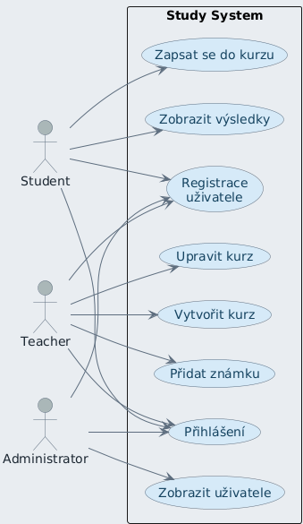
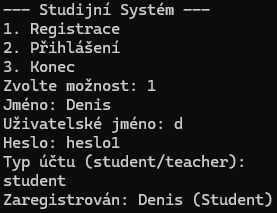
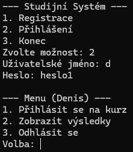

# Study System

This is a study management system designed to handle users (students, teachers, and administrators), courses, and grades. The system makes use of various design patterns such as Strategy, Observer, and Factory to manage users, courses, and grading strategies.

## Use Case


## Roles

### 1. Student
Students can:
- Register for courses.
- View their course results.
- Receive notifications about course updates.

### 2. Teacher
Teachers can:
- Create new courses.
- Modify course descriptions.
- Assign grades to students.
- View enrolled students in their courses.

### 3. Administrator
Administrators can:
- View and manage all users in the system.

## Main Features
- **Register:** Users can register with specific roles (Student, Teacher, Administrator).
  
  
- **Login:** Users can log in using their username and password.
  

- **Course Management:** Teachers can create and manage courses, while students can register for courses and view their results.

- **Grading Strategies:** Supports multiple grading strategies, including Arithmetic Average and Weighted Average.

- **User Notifications:** Uses the Observer pattern to notify users about changes in the system, like course registration or course updates.

## System Design

The system is built using multiple design patterns:
- **Strategy Pattern:** Used for defining different grading strategies (`ArithmeticAverageStrategy`, `WeightedAverageStrategy`).
- **Observer Pattern:** Allows the system to notify users (students) about important events such as course enrollment or updates.
- **Factory Pattern:** Used for creating users with different roles (Student, Teacher, Administrator) using respective factories.

## Setup and Usage

1. Clone the repository:
   ```bash
   git clone https://github.com/yourusername/study-system.git
   cd study-system
